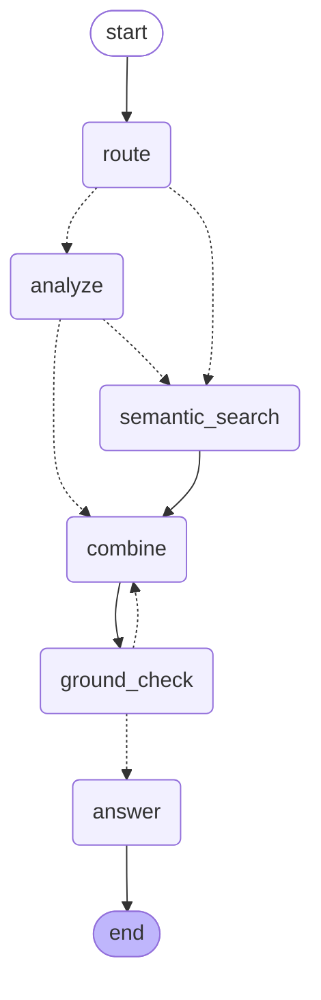

```mermaid
graph TD;
    __start__([start]):::first
    route(route)
    analyze(analyze)
    semantic_search(semantic_search)
    combine(combine)
    ground_check(ground_check)
    answer(answer)
    __end__([end]):::last
    __start__ --> route;
    route -.-> analyze;
    route -.-> semantic_search;
    analyze -.-> combine;
    analyze -.-> semantic_search;
    semantic_search --> combine;
    combine --> ground_check;
    ground_check -.-> answer;
    ground_check -.-> combine;
    answer --> __end__;
    classDef default fill:#f2f0ff,line-height:1.2
    classDef first fill-opacity:0
    classDef last fill:#bfb6fc
```